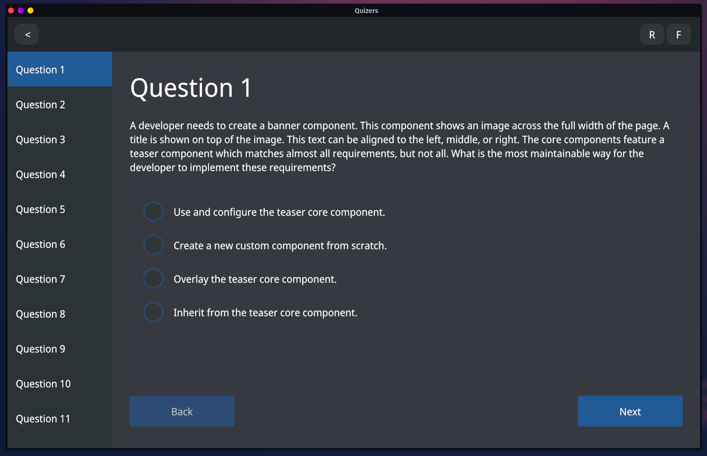

  <h1><code>quizers</code></h1>

  <h3>
    <strong>Learn new stuff easier</strong>
  </h3>

  

    
    
  

  <h3>
    <a href="#about">About</a>
     | 
    <a href="#demo">Demo</a>
     | 
    <a href="#installation">Installation</a>
     | 
    <a href="#configuration">Configuration</a>
     | 
    <a href="#license">License</a>
     | 
    <a href="#contribution">Contribution</a>
  </h3>

  <h4>Built with 🦀</h4>

# 
About

This app helps you to test your knowledge on specific topic with quiz-like experience.

> :warning: This is very much work in progress and it's not usable at this point without manual
  code changes.

It uses questions stored in a markdown file with specific convention, which you can find
[here](https://github.com/devzbysiu/md-questions).

# 
Demo

# 
Installation

## --- TODO ---

# 
Configuration

## --- TODO ---

# 
License

This project is licensed under either of

- Apache License, Version 2.0, (LICENSE-APACHE or http://www.apache.org/licenses/LICENSE-2.0)
- MIT license (LICENSE-MIT or http://opensource.org/licenses/MIT)

at your option.

# 
Contribution

Unless you explicitly state otherwise, any contribution intentionally submitted for inclusion in the work by you, as defined in the Apache-2.0 license, shall be dual licensed as above, without any additional terms or conditions.
